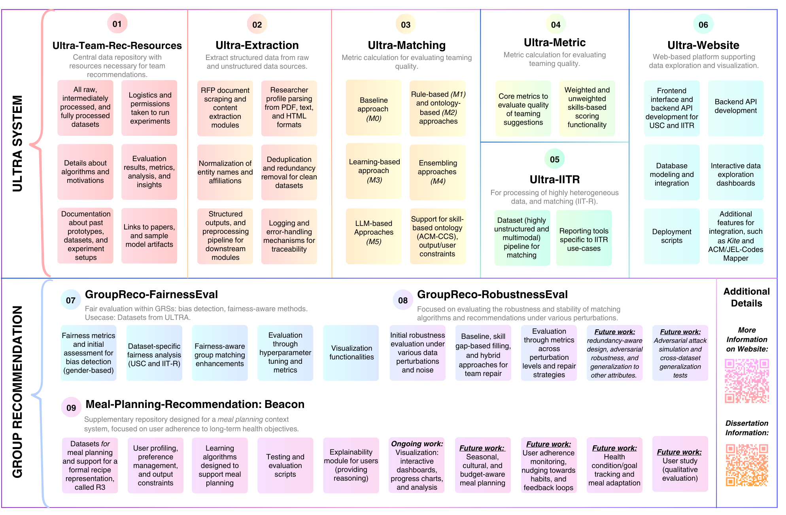
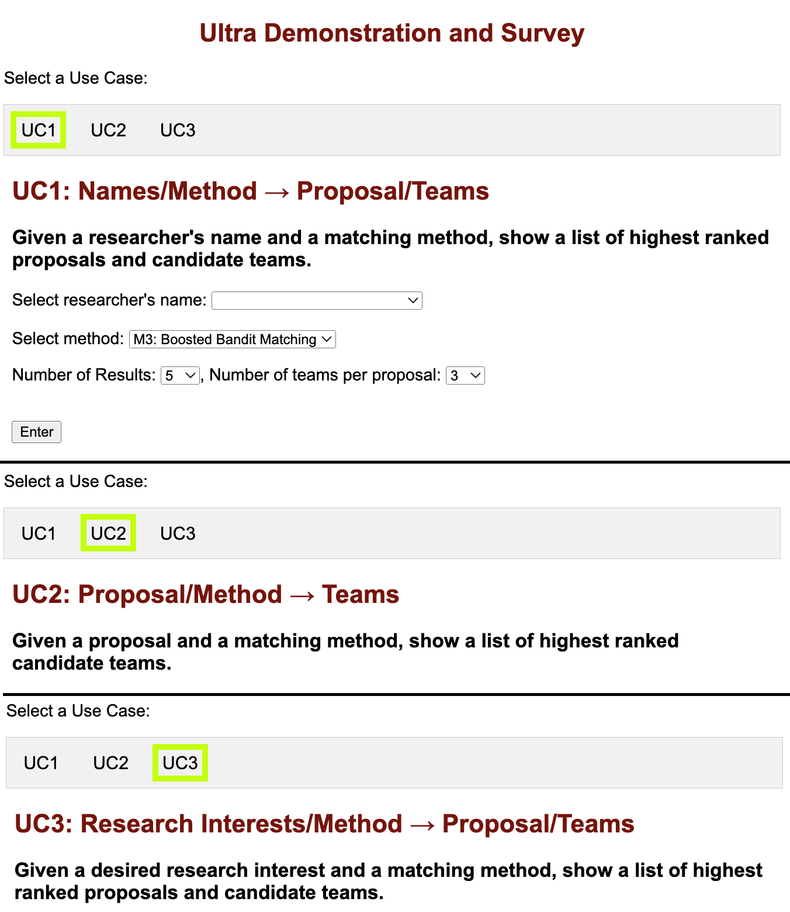

# ULTRA-Team-Recommendation-Resources

This resource acts as a central hub to the following resources: 
.

## Sample Demo:

## Papers:
For more information on this repository, please view the papers below: 

- **[AI‐assisted research collaboration with open data for fair and effective response to call for proposals](https://onlinelibrary.wiley.com/doi/epdf/10.1002/aaai.12203)**  
  Authors: Siva Likitha Valluru, Michael Widener, Biplav Srivastava, Sriraam Natarajan, Sugata Gangopadhyay
  Published in: AAAI AI Magazine, 2024

- **[Promoting research collaboration with open data driven team recommendation in response to call for proposals](https://doi.org/xx.xxxx/xxxxx)**  
  Authors: Siva Likitha Valluru, Biplav Srivastava, Sai Teja Paladi, Siwen Yan, Sriraam Natarajan
  Published in: Proceedings of the AAAI Conference on Artificial Intelligence (IAAI), 2024

- **[ULTRA: Exploring Team Recommendations in Two Geographies Using Open Data in Response to Call for Proposals](https://dl.acm.org/doi/pdf/10.1145/3632410.3632503?casa_token=8OnOfm0ih5UAAAAA:I3Ng8oTohbLefO-JAnQuanTY9cWI8Pv1mcLA8_TbiHKvQbxqS8JryN0r_-duz2jv_yJy09dEOf5u5g)**  
  Authors: Siva Likitha Valluru, Michael Widener, Biplav Srivastava, Sugata Gangopadhyay
  Published in: CODS-COMAD '24: Proceedings of the 7th Joint International Conference on Data Science & Management of Data (11th ACM IKDD CODS and 29th COMAD)

- **[ULTRA: A data-driven approach for recommending team formation in response to proposal calls](https://ieeexplore.ieee.org/abstract/document/10031089)**  
  Authors: Biplav Srivastava, Tarmo Koppel, Sai Teja Paladi, Siva Likitha Valluru, Rohit Sharma, Owen Bond
  Published in: IEEE International Conference on Data Mining Workshops (ICDMW), 2022

Both the code and data in this repository were developed as part of the research. The data is still being actively used in ongoing work. If you have any questions, would like more details, or are interested in building on this work, please feel free to reach out. More information about ongoing efforts can be found on our [website](https://ai4society.github.io/projects/group_rec/index.html). 
